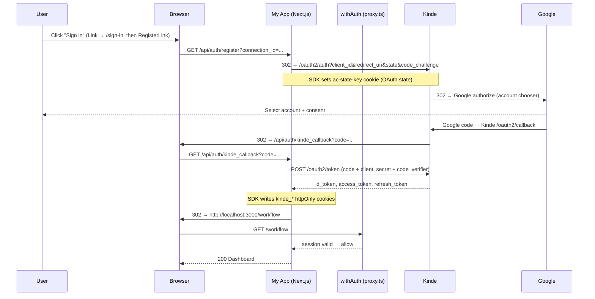
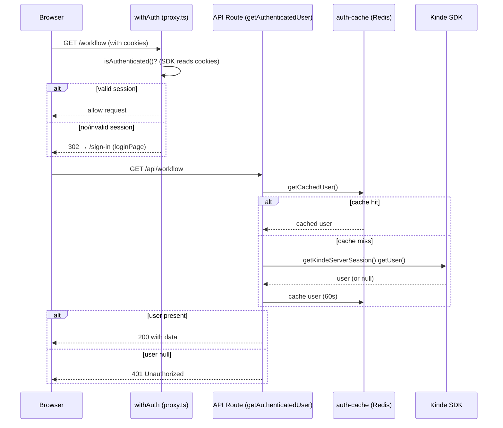
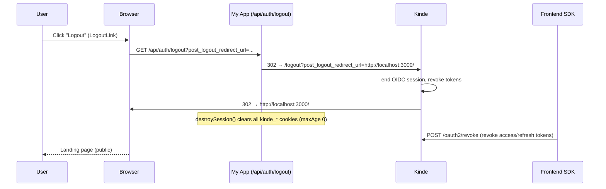

# KINDEDOCS.md — Authentication Architecture in This Project

> This document describes **exactly** how authentication works in the Flowagent.ai
> codebase. Every claim is based on the actual source files in this repository and
> the installed `@kinde-oss/kinde-auth-nextjs@2.12.2` SDK (verified against its
> published build inside `node_modules`). Where behavior is handled internally by
> the Kinde SDK rather than our code, that is explicitly called out.
>
> Project: **Flowagent.ai** — Next.js 16.2.12 (App Router), React 19, TypeScript.
> Branch at time of writing: `qa`.

---

## 1. High Level Architecture

### Provider
- **Kinde** is the identity provider. It is the only auth provider in the app.
- The app ships **custom sign-in/sign-up UI** at `/sign-in` (`app/(routes)/(landing)/sign-in/`),
  rendered on our own domain. It offers a single **"Continue with Google"** button that uses
  `RegisterLink` with `connection_id=KINDE_GOOGLE_CONNECTION_ID` to skip Kinde's connection
  chooser. There is no hosted Kinde login screen in the flow (the Kinde dashboard's *Use your own
  sign-up and sign-in screens* toggle is on; the middleware is configured with
  `loginPage: "/sign-in"`).
- Kinde issues standard OpenID Connect / OAuth 2.0 **JWT**s (ID token + access
  token) after the user authenticates.

### Kinde packages used
| Package | Version | Role |
|---|---|---|
| `@kinde-oss/kinde-auth-nextjs` | `^2.12.2` (installed 2.12.2) | Server + client SDK for Next.js App Router |
| `@kinde-oss/kinde-auth-react` (transitive dependency) | — | Frontend SDK used under the hood by `useKindeBrowserClient` |
| `next` | `16.2.12` | App framework; middleware host |
| `@kinde-oss/kinde-auth-nextjs/server` | same package | Exposes `handleAuth()`, `getKindeServerSession()` |
| `@kinde-oss/kinde-auth-nextjs/middleware` | same package | Exposes `withAuth()` |
| `@kinde-oss/kinde-auth-nextjs` (root) | same package | Exposes `LoginLink`, `LogoutLink`, `KindeProvider`, `useKindeBrowserClient` |

### Routes that participate in authentication

**App-side auth routes** (single catch-all route file):
```
app/api/auth/[kindeAuth]/route.ts
```
The dynamic segment `[kindeAuth]` is matched by `handleAuth()` and maps to these
SDK handlers (SDK-internal map in `dist/src/handlers/auth.cjs.js`):

| Route | Handler (SDK) | Purpose |
|---|---|---|
| `GET /api/auth/login` | `login` | Redirect to Kinde `/oauth2/auth` (authorize) |
| `GET /api/auth/register` | `register` | Redirect to Kinde `/oauth2/auth` in sign-up mode |
| `GET /api/auth/kinde_callback` | `callback` | OAuth callback → exchange code → create session |
| `GET /api/auth/logout` | `logout` | Redirect to Kinde `/logout` to end the session |
| `GET /api/auth/end_session` | `endSession` | Session end helper (SDK) |
| `GET /api/auth/create_org` | `createOrg` | Organization creation (SDK, unused by app) |
| `GET /api/auth/setup` | `setup` | SDK setup helper (unused by app) |
| `GET /api/auth/portal` | `portal` | Self-serve portal helper (unused by app) |
| `GET /api/auth/health` | `health` | Health check (unused by app) |

**Routes that *consume* auth (protected API):**
- `GET|POST /api/workflow` — `app/api/workflow/route.ts`
- `GET|PUT|DELETE /api/workflow/[workflowId]` — `app/api/workflow/[workflowId]/route.ts`

**Routes that are public (excluded from auth):**
- `/` (landing page) — `app/(routes)/(landing)/page.tsx`
- `/sign-in` — `app/(routes)/(landing)/sign-in/page.tsx` (custom login page; public so it renders for unauthenticated users)
- `/api/auth` — all Kinde auth handlers (login/register/callback/logout)
- `/api/upstash/trigger` — `app/api/upstash/trigger/route.ts` (QStash webhook target)
- `/api/workflow/live-chat` — `app/api/workflow/live-chat/route.ts` (SSE stream)

### Middleware involved
- **`proxy.ts`** is the Next.js middleware file (root of repo). It wraps
  `withAuth()` from `@kinde-oss/kinde-auth-nextjs/middleware`. It:
  - Protects every matched route **except** `publicPaths: ["/", "/api/auth", "/api/upstash/trigger", "/api/workflow/live-chat"]`.
  - Redirects unauthenticated users to the **custom login page** via `loginPage: "/sign-in"`.
  - Excludes `_next` assets and static files via the `config.matcher` regex.

### Authentication flow overview
```
Browser ──GET──▶ /workflow (or any protected route)
        ◀─302── /sign-in (loginPage)
        ──click── RegisterLink → /api/auth/register?post_login_redirect_url=/workflow&connection_id=...
        ──302── https://nay2002.kinde.com/oauth2/auth?client_id=...&redirect_uri=...&code_challenge=...
        ──302── Google (account chooser) ──▶ back to Kinde
        ──302── http://localhost:3000/api/auth/kinde_callback?code=...
        ◀────  kinde_* cookies set (httpOnly)
        ──302── http://localhost:3000/workflow
```
Every step is detailed in §2, §3, §4.

---

## 2. Complete Login Flow

Starting point: an unauthenticated user clicks **"Sign in"** or **"Get Started"**
on the landing page, or directly visits a protected page (e.g. `/workflow`).

### Step-by-step

**Step 1 — User clicks a login trigger**
- **Page/component:** `app/(routes)/(landing)/page.tsx` renders plain `<Link href="/sign-in">`
  ("Sign in" / "Get Started"). Alternatively, the middleware redirect (Step 2) lands on the same
  custom page.
- **Function:** `/sign-in` renders `<SignInForm>` (`app/(routes)/(landing)/sign-in/page.tsx` →
  `sign-in-form.tsx`), a client component with a toggle between **Sign in** and **Sign up**. Both
  modes render a single `<RegisterLink>` (the Kinde SDK component) whose `href` is built as:
  ```
  /api/auth/register?post_login_redirect_url=/workflow&connection_id=<KINDE_GOOGLE_CONNECTION_ID>
  ```
  (`RegisterLink` uses the SDK's register route; `authUrlParams` injects `connection_id` so the
  Kinde connection chooser is skipped and Google is used directly.)
- **HTTP:** `GET` navigation (client-side link click → browser GET to `/api/auth/register`).
- **File handling:** `app/api/auth/[kindeAuth]/route.ts` → `handleAuth()` →
  SDK `register` handler.

**Step 2 — `GET /api/auth/register`**
- **Function:** SDK `register` handler (`dist/src/handlers/register.cjs.js`).
- **Parameters:** query string (e.g. `post_login_redirect_url`, `connection_id`).
- **Response:** HTTP `302` redirect to the Kinde authorize endpoint in sign-up mode:
  ```
  https://nay2002.kinde.com/oauth2/auth
    ?client_id=<KINDE_CLIENT_ID>
    &redirect_uri=http://localhost:3000/api/auth/kinde_callback
    &response_type=code
    &scope=openid%20profile%20email%20offline_access
    &state=<opaque-random>            (stored in ac-state-key cookie)
    &code_challenge=<S256 of verifier>  (PKCE)
    &code_challenge_method=S256
    &connection_id=conn_...           (when present, Google is preselected)
  ```
- **Cookies created:** `ac-state-key` (OAuth state, for CSRF/state validation).
  Confirmed SDK OAuth settings: `grantType: "AUTHORIZATION_CODE"`,
  `responseType: "code"`, `codeChallengeMethod: "S256"` (PKCE enabled by SDK).
- **Session changes:** none yet (no session exists).

**Step 3 — Kinde authorize screen**
- Kinde renders its authorize page on `nay2002.kinde.com`. Because the app passes
  `connection_id=KINDE_GOOGLE_CONNECTION_ID`, the **Google** connection is preselected and the
  user is sent straight to Google's account chooser (no connection picker step).

**Step 4 — Google account selection**
- The browser is redirected to Google's own OAuth screen (`accounts.google.com`).
- The user picks/enters an account and approves the scopes.

**Step 5 — Google → Kinde**
- Google redirects back to Kinde's `/oauth2/callback` with a Google
  authorization code. Kinde exchanges it with Google's token endpoint
  (entirely on Kinde's servers — not our code, not visible to the app).

**Step 6 — Kinde → My App (callback)**
- Kinde redirects the browser to the registered redirect URI:
  ```
  http://localhost:3000/api/auth/kinde_callback?code=<auth-code>&state=<...>
  ```
- **HTTP method:** `GET`.
- **File handling:** `app/api/auth/[kindeAuth]/route.ts` → SDK `callback` handler
  (`dist/src/handlers/callback.cjs.js`). Full detail in §4.

**Step 7 — Token exchange (server side, SDK)**
- The SDK POSTs to Kinde's token endpoint:
  ```
  POST https://nay2002.kinde.com/oauth2/token
  Content-Type: application/x-www-form-urlencoded
  grant_type=authorization_code
  &code=<auth-code>
  &redirect_uri=http://localhost:3000/api/auth/kinde_callback
  &client_id=<KINDE_CLIENT_ID>
  &client_secret=<KINDE_CLIENT_SECRET>
  &code_verifier=<PKCE verifier>
  ```
  (verified: `fetch(`${issuerURL}/oauth2/token`, { method: "POST", ... })` in
  `dist/src/api-client.cjs.js`).
- **Response (Kinde):** JSON containing `access_token`, `id_token`,
  `refresh_token`, `expires_in`, token type, scopes.
- **Session creation:** The SDK decodes/serializes the user and writes cookies
  (see §5). No application code runs during this exchange.

**Step 8 — Redirect after login**
- The SDK redirects (302) to the post-login URL, which for this project is
  configured as `http://localhost:3000/workflow`
  (`KINDE_POST_LOGIN_REDIRECT_URL` in `.env`).
- The user lands on the **workflow dashboard** (`app/(routes)/(dashboard)/workflow/page.tsx`).
- The dashboard `AppHeader` (`app/(routes)/(dashboard)/_common/header.tsx`) now
  shows the user's avatar/initials via `useKindeBrowserClient()`.

### Summary table
| # | Trigger | Function | URL (method) | Response |
|---|---|---|---|---|
| 1 | `Link href="/sign-in"` click | custom page → `RegisterLink` | `/sign-in` (GET) | 200 custom form |
| 2 | register handler | SDK `register` | `/api/auth/register?connection_id=...` (GET) | 302 → Kinde |
| 3 | Kinde authorize | Kinde (Google preselected) | Kinde `/oauth2/auth` (GET) | 302 |
| 4 | Google account picker | Google | `accounts.google.com` (GET) | 302 |
| 5 | Google callback | Kinde | Kinde `/oauth2/callback` | — |
| 6 | Kinde redirect | Kinde | `/api/auth/kinde_callback?code=...` (GET) | 302 after handling |
| 7 | Token exchange | SDK `callback` | Kinde `/oauth2/token` (POST) | JSON tokens |
| 8 | Post-login redirect | SDK | `/workflow` (GET) | 200 dashboard |

---

## 3. Google OAuth Flow

Who talks to whom, hop by hop:

```
Browser ──▶ My App ──▶ Kinde ──▶ Google ──▶ Kinde ──▶ My App ──▶ Dashboard
```

1. **Browser → My App**
   User clicks "Sign in"/"Get Started" on the landing page (or hits a protected route).
   Lands on the custom page `GET /sign-in`. Clicking the Google button fires
   `GET /api/auth/register?connection_id=...` (App route).

2. **My App → Kinde**
   `handleAuth()` → SDK `register` handler issues a `302` to
   `https://nay2002.kinde.com/oauth2/auth?...&redirect_uri=<app callback>&code_challenge=S256&connection_id=...`.
   The `ac-state-key` cookie is set by the SDK for state validation.

3. **Kinde → Google**
   Kinde renders its authorize page with the **Google** connection preselected
   (via `connection_id`), then redirects the browser to Google's authorization
   endpoint with Google's own client id (configured in the Kinde dashboard under
   *Settings → Authentication → Google*).

4. **Google (user interaction)**
   The user selects an account on `accounts.google.com` and consents to the
   requested scopes. Google issues a Google authorization code.

5. **Google → Kinde**
   Google redirects back to **Kinde's** `/oauth2/callback` with the Google code.
   Kinde exchanges it with Google's token endpoint server-side. Kinde now has a
   Kinde-level profile for the user (creating a Kinde user if it's the first
   time — this is why a new Google email triggers Kinde's *"create account"*
   screen). This hop is **invisible to the app**.

6. **Kinde → My App**
   Kinde redirects the browser to the app's registered redirect URI:
   `http://localhost:3000/api/auth/kinde_callback?code=<kinde-auth-code>&state=<...>`.

7. **My App → Kinde (token exchange)**
   The SDK (server-side, in the API route) POSTs the auth code to
   `https://nay2002.kinde.com/oauth2/token` using `client_id`,
   `client_secret`, and the PKCE `code_verifier`. Kinde returns the JWT
   access/ID tokens plus a refresh token. This happens **entirely server-side** —
   the client secret never leaves the server (see §16).

8. **My App → Browser (session established)**
   The SDK writes the `kinde_*` httpOnly cookies and redirects (302) to
   `http://localhost:3000/workflow`.

9. **Browser → My App (dashboard)**
   `GET /workflow` renders the dashboard. `withAuth` middleware sees a valid
   session (cookies present) and allows the request. `useKindeBrowserClient()`
   hydrates user info from the session cookies client-side.

---

## 4. Callback Flow

**Callback URL:** `http://localhost:3000/api/auth/kinde_callback`
(verified: SDK sets `redirectURL = ${KINDE_SITE_URL}${apiPath}/kinde_callback`
with `apiPath = /api/auth`, `dist/src/config/index.cjs.js`).

**What happens after Google authentication succeeds:**

1. Browser arrives at `GET /api/auth/kinde_callback?code=<authorization_code>&state=<...>`
   (also possibly `error`/`error_description` params on failure).

2. **File handling:** `app/api/auth/[kindeAuth]/route.ts` — the `[kindeAuth]`
   segment equals `kinde_callback`, so `handleAuth()` dispatches to the SDK
   `callback` handler (`dist/src/handlers/callback.cjs.js`).

3. **Authorization code:** the `code` query param is an OAuth authorization code
   issued by Kinde. It is single-use and short-lived.

4. **Token exchange (SDK):** the SDK sends
   `POST https://nay2002.kinde.com/oauth2/token` with:
   `grant_type=authorization_code`, `code`, `redirect_uri`, `client_id`,
   `client_secret`, `code_verifier`. Kinde replies with:
   - `id_token` (JWT — user identity)
   - `access_token` (JWT — API access)
   - `refresh_token` (used to mint new tokens)
   - `expires_in`, `token_type`

5. **Session creation (SDK):** the SDK stores the tokens and the decoded user in
   httpOnly cookies (see §5). This is what makes the user "logged in".

6. **Cookies created:** `ac-state-key` is cleared; `user`, `id_token`,
   `access_token`, `refresh_token`, `id_token_payload`, `access_token_payload`,
   `post_login_redirect_url` are set (large values chunked as `name`,
   `name1`, `name2`, …).

7. **Redirect destination:** the SDK issues a `302` to the post-login URL —
   `http://localhost:3000/workflow` (from `KINDE_POST_LOGIN_REDIRECT_URL`).
   The next request to `/workflow` passes the `withAuth` middleware because the
   session cookies are present.

---

## 5. Session Management

### Where sessions are stored
- **Server side:** sessions are **stateless** — the SDK stores token material in
  signed/httpOnly **cookies** (browser-side). No session table exists in MongoDB.
- **Optional cache:** `lib/auth-cache.ts` caches the resolved user object in
  **Upstash Redis** for 60 seconds to avoid hitting Kinde's OIDC userinfo on
  every request. This is a read-cache of identity, *not* the session itself.

### Cookies created (from SDK `COOKIE_LIST`, `dist/src/utils/constants.cjs.js`)
| Cookie | Content | Purpose |
|---|---|---|
| `ac-state-key` | OAuth state | CSRF / state validation during login; cleared after callback |
| `id_token` | JWT ID token (string) | User identity |
| `id_token_payload` | Decoded payload | Fast client-side identity access |
| `access_token` | JWT access token (string) | Authorized API access |
| `access_token_payload` | Decoded payload | Fast client-side access |
| `refresh_token` | OAuth refresh token | Automatic token refresh |
| `user` | Serialized user object | `getUser()` reads this |
| `post_login_redirect_url` | URL string | Where to land after login |

### Cookie properties (SDK defaults, `GLOBAL_COOKIE_OPTIONS`)
- `httpOnly: true` — JS cannot read token cookies.
- `sameSite: "lax"` — CSRF protection.
- `secure: true` in production, `false` in dev (localhost).
- `path: "/"`.
- `maxAge: 2505600` (~29 days) for persistent session cookies.
- Values longer than 3000 bytes (`MAX_COOKIE_LENGTH`) are split across cookies
  `name`, `name1`, `name2`, …

### Expiration & refresh
- **Token lifetime:** determined by Kinde (`expires_in`). Cookie lifetime is
  capped at ~29 days.
- **Refresh process (SDK-internal):** the SDK keeps the `refresh_token` cookie.
  When the access/ID token expires, the SDK exchanges the refresh token at
  `https://nay2002.kinde.com/oauth2/token` (`grant_type=refresh_token`).
  A server action `refreshTokensServerAction` exists inside
  `dist/src/session/refreshTokensServerAction.cjs.js`; **our code never calls
  it** — the SDK triggers refresh automatically. On refresh failure the session
  is treated as expired.

### How the SDK validates sessions (SDK-internal)
- `getKindeServerSession()` (`dist/src/session/index.cjs.js`) reads the
  `user`/`id_token`/`access_token` cookies and, on demand, validates the JWT
  signature/expiry against Kinde's JWKS and/or calls the OIDC userinfo endpoint.
- The app itself **does not** decode or verify JWTs — all validation happens
  inside the Kinde SDK server client.

### How protected pages know the user is authenticated
- **Middleware (`proxy.ts`):** `withAuth()` runs on every matched request. It
  calls the SDK's `isAuthenticated()` (checks presence/validity of session
  cookies). Authenticated → request proceeds; unauthenticated → 302 to login.
- **Server components / API routes:** call `getAuthenticatedUser()` from
  `lib/api-utils.ts`, which calls `getCachedUser()` from `lib/auth-cache.ts`.
  Returns `null` when there is no valid Kinde session.
- **Client components:** `useKindeBrowserClient()` (used in the dashboard
  header) exposes `user`, `isLoading`, `isAuthenticated` from the frontend SDK.

---

## 6. User Data

### Where user information comes from
- The user object originates from **Kinde**, delivered as the **ID token** JWT
  claims and the OIDC userinfo profile (Google profile → Kinde → ID token).
- On the server, `getKindeServerSession().getUser()` returns it
  (`lib/auth-cache.ts:30-32`).
- On the client, `useKindeBrowserClient()` exposes it (dashboard header,
  `app/(routes)/(dashboard)/_common/header.tsx:23`).

### Are users stored in MongoDB?
- **No.** The Prisma schema (`prisma/schema.prisma`) defines a single model,
  `Workflow`, with a `userId: String` column. There is **no `User` model** and
  no user synchronization job. User identity lives **only inside Kinde**.

### How getUser() works
- Server-side: `getKindeServerSession().getUser()` is an SDK function. It reads
  the session (cookies), ensures the token is valid, and returns the user
  object parsed from the ID token. It is *not* a database lookup.
- Client-side: `useKindeBrowserClient()` hydrates the same data from the session
  (via the frontend SDK `@kinde-oss/kinde-auth-react`).

### Which fields are returned
Kinde's user object (from the ID token) typically includes:
- `id` — the Kinde user ID (used as `Workflow.userId`)
- `email`
- `given_name`, `family_name`, `name`
- `picture` (avatar URL from Google)
- plus optional claims: `phone`, `is_verified`, organization claims, permissions,
  custom properties depending on Kinde configuration.

### How avatar / name / email are obtained in this app
- `app/(routes)/(dashboard)/_common/header.tsx:56-62`:
  - `AvatarImage src={user.picture}` — avatar URL.
  - `AvatarFallback` shows `user.given_name?.[0] + user.family_name?.[0]` —
    initials when no picture.
- The app never stores or persists these — they are re-fetched from the session
  on every load.

---

## 7. Database Usage

### Models that reference authenticated users
- Only one model references a user: **`Workflow`**
  (`prisma/schema.prisma:11-23`):
  ```prisma
  model Workflow {
    id         String   @id @default(auto()) @map("_id") @db.ObjectId
    userId     String
    name       String
    description String
    flowObject String   @default("{}")
    createdAt  DateTime @default(now())
    updatedAt  DateTime @updatedAt
    @@index([userId, createdAt])
    @@unique([userId, name])
  }
  ```

### Why there is no User table
- Authentication/identity is fully delegated to Kinde. The app treats "user" as
  an opaque authenticated identity whose ID comes from the Kinde session. There
  is no app-side user profile, settings, or permissions model, so a User table
  would be redundant.

### How `Workflow.userId` relates to Kinde user IDs
- `Workflow.userId` stores the string returned by
  `getAuthenticatedUser().id`, which is the **Kinde user ID**
  (`lib/api-utils.ts:6-10` → `getCachedUser()` → `getKindeServerSession().getUser().id`).
- When creating a workflow (`app/api/workflow/route.ts:61-72`), the code writes
  `userId: user.id` from the authenticated session.

### Is anything synchronized into MongoDB?
- **No.** Nothing copies users, profiles, or tokens into MongoDB. The only
  user-related data written is the `userId` string on workflow documents. The
  Redis cache (`lib/auth-cache.ts`) is ephemeral (60s TTL) and stores only the
  user object for lookups, not a durable user record.

---

## 8. Logout Flow

1. **Trigger:** the user opens the avatar dropdown in the dashboard header
   (`app/(routes)/(dashboard)/_common/header.tsx:64-71`) and clicks **"Logout"**,
   which is a `<LogoutLink>`.

2. **`LogoutLink`** (SDK component) renders an `<a>` with:
   ```
   /api/auth/logout?post_logout_redirect_url=http://localhost:3000/
   ```
   (`href: ${apiPath}/${routes.logout}?post_logout_redirect_url=...` verified in
   `dist/src/components/LogoutLink.cjs.js`; the URL comes from
   `KINDE_POST_LOGOUT_REDIRECT_URL`.)

3. **`GET /api/auth/logout`** — handled by `app/api/auth/[kindeAuth]/route.ts`
   → SDK `logout` handler (`dist/src/handlers/logout.cjs.js`).

4. **Kinde logout:** the SDK redirects (302) to Kinde's logout endpoint:
   ```
   https://nay2002.kinde.com/logout?post_logout_redirect_url=http://localhost:3000/
   ```
   (Kinde's issuer logout route is `/logout`, per SDK `issuerRoutes` config.)

5. **Kinde ends the OIDC session** and redirects the browser back to
   `http://localhost:3000/` (the configured post-logout URL).

6. **Cookies deleted:** the SDK's session manager `destroySession()` deletes all
   cookies whose names start with entries in `COOKIE_LIST` (sets them to empty
   with `maxAge: 0`). So `user`, `id_token`, `access_token`, `refresh_token`,
   payloads, and `ac-state-key` are cleared on the server response.
   (`destroySession` verified in `dist/src/session/sessionManager.cjs.js`.)

7. **Token revocation (frontend SDK):** the client-side frontend SDK
   (`@kinde-oss/kinde-auth-react`) additionally revokes tokens at
   `https://nay2002.kinde.com/oauth2/revoke` (POST) so revoked access/refresh
   tokens can't be reused (`POST /oauth2/revoke` verified in the frontend build).

8. **Browser redirect:** the user lands on the public landing page
   (`app/(routes)/(landing)/page.tsx`). The `withAuth` middleware now sees no
   session cookies, so any subsequent attempt to visit `/workflow` redirects
   back to login.

---

## 9. Protected Routes

### Which routes require login
- All **dashboard** routes:
  - `/workflow` — workflow list (`app/(routes)/(dashboard)/workflow/page.tsx`)
  - `/SingleWorkflow/[workflowId]` — visual editor
  - `/`? **No** — `/` (landing) is public.
- All **API** routes except the two public ones:
  - `GET|POST /api/workflow`
  - `GET|PUT|DELETE /api/workflow/[workflowId]`

### Which middleware checks authentication
- **`proxy.ts`** (repo root). It is the Next.js middleware:
  ```ts
  export default withAuth(async function proxy() {}, {
    publicPaths: ["/", "/api/auth", "/api/upstash/trigger", "/api/workflow/live-chat"],
    loginPage: "/sign-in",
  });
  export const config = {
    matcher: ["/((?!_next|[^?]*\\.(?:html?|css|js(?!on)|jpe?g|webp|png|gif|svg|ttf|woff2?|ico|csv|docx?|xlsx?|zip|webmanifest)).*)"],
  };
  ```
- `withAuth` is the SDK's middleware; it calls the SDK's session check
  (`isAuthenticated()`) and enforces `publicPaths`. Unauthenticated users are
  redirected to `loginPage` (`/sign-in`).

### What happens if a user is not authenticated
- **Page routes:** `withAuth` issues a `302` redirect to the custom login page
  `/sign-in` (the SDK's `loginPage` option). After login the user is returned to
  where they were going.
- **API routes:** the API routes **re-check auth server-side** (defense in
  depth) via `getAuthenticatedUser()`:
  - `app/api/workflow/route.ts:11` (GET/POST)
  - `app/api/workflow/[workflowId]/route.ts:19,58,108` (GET/PUT/DELETE)
  - If `getAuthenticatedUser()` returns `null`, they return a `401`
    (`unauthorizedResponse()`, `lib/api-utils.ts:12-17`).

---

## 10. Environment Variables

All auth-related variables (from `.env` / `.env.example`):

| Variable | Purpose | Where used | What breaks if missing |
|---|---|---|---|
| `KINDE_CLIENT_ID` | Kinde application (public) client identifier | SDK OAuth authorize + token exchange | `handleAuth()` throws `env variable 'KINDE_CLIENT_ID' is not set`; login breaks |
| `KINDE_CLIENT_SECRET` | Kinde application secret; **server-only** | SDK token exchange (`/oauth2/token`) | `handleAuth()` throws `env variable 'KINDE_CLIENT_SECRET' is not set`; token exchange fails |
| `KINDE_ISSUER_URL` | Kinde tenant base URL (`https://nay2002.kinde.com`) | All SDK calls to Kinde (authorize, token, logout, userinfo) | `handleAuth()` throws `The environment variable 'KINDE_ISSUER_URL' is required.` |
| `KINDE_SITE_URL` | App origin; base for the callback redirect URI | SDK builds `redirectURL = ${KINDE_SITE_URL}/api/auth/kinde_callback` | `handleAuth()` throws `env variable 'KINDE_SITE_URL' is not set`; callback mismatches |
| `KINDE_POST_LOGIN_REDIRECT_URL` | Destination after successful login (`http://localhost:3000/workflow`) | SDK `login`/`callback` redirect target | User lands on a default/root route instead of the dashboard |
| `KINDE_POST_LOGOUT_REDIRECT_URL` | Destination after logout (`http://localhost:3000/`) | `LogoutLink` → `/api/auth/logout` → Kinde `/logout` | Post-logout redirect falls back to SDK default |
| `KINDE_GOOGLE_CONNECTION_ID` | Kinde Google connection id (e.g. `conn_019e...`) | Passed as `connection_id` by `RegisterLink` on `/sign-in` to preselect Google | Sign-in page falls back to Kinde's connection chooser (extra click) |
| `UPSTASH_REDIS_REST_URL` | Redis endpoint for the user cache + rate limiting | `lib/auth-cache.ts`, `lib/rate-limit.ts`, `lib/redis.ts` | Auth cache disabled (falls back to direct Kinde calls); rate limit falls back to in-memory |
| `UPSTASH_REDIS_REST_TOKEN` | Redis auth token | same as above | Same as above (graceful fallback) |

Optional / production-only:
| Variable | Purpose | Notes |
|---|---|---|
| `VERCEL_PROTECTION_BYPASS_TOKEN` | Allows QStash/SSE to hit a protected Vercel preview | Not auth flow — used by `app/api/upstash/trigger/route.ts` and `lib` QStash client headers |
| `VERCEL_OIDC_TOKEN` | Vercel workload identity (present in `.env.local`) | Deployment-level; not used by Kinde flow |

Non-auth vars present in `.env` (for context): `DATABASE_URL`, `OPENROUTER_API_KEY`,
`QSTASH_TOKEN`, `QSTASH_BASE_URL`, `QSTASH_CURRENT_SIGNING_KEY`,
`QSTASH_NEXT_SIGNING_KEY`, `QSTASH_DEV`.

---

## 11. Sequence Diagrams

### Login


### Callback
```mermaid
sequenceDiagram
    participant K as Kinde
    participant A as My App (handleAuth → callback)
    participant R as Redis (auth-cache)
    participant S as Session Cookies

    K->>A: GET /api/auth/kinde_callback?code&state
    A->>K: POST /oauth2/token (authorization_code)
    K-->>A: id_token + access_token + refresh_token
    A->>S: set user, id_token, access_token, refresh_token, *_payload cookies
    Note over A,S: httpOnly, sameSite=lax, ~29 day maxAge; cleared ac-state-key
    A->>R: (optional) cache user object for 60s
    A-->>K: 302 → KINDE_POST_LOGIN_REDIRECT_URL (/workflow)
```

### Session validation (protected route / API)


### Logout


---

## 12. File Reference

| File | Responsibility | Exports | Connects to |
|---|---|---|---|
| `app/api/auth/[kindeAuth]/route.ts` | Single entry point for **all** auth routes (login, register, callback, logout, …) | `GET = handleAuth()` | Kinde SDK `handleAuth()`; invoked by `RegisterLink`/`LogoutLink`/middleware redirects |
| `proxy.ts` (repo root) | Next.js middleware; guards all non-public routes | default `withAuth()` + `config` | Kinde SDK `withAuth`; redirects unauthenticated traffic to `/sign-in` (`loginPage`)
| `lib/auth-cache.ts` | Redis-cached user lookup to reduce Kinde calls | `getCachedUser()`, `buildSessionKey()` (internal) | `redis` (`lib/redis.ts`), Kinde `getKindeServerSession()`; consumed by `lib/api-utils.ts` |
| `lib/api-utils.ts` | Shared API auth guards + HTTP responses | `getAuthenticatedUser()`, `unauthorizedResponse()`, `serverErrorResponse()`, `maxDuration` | `lib/auth-cache.ts`; used by all `/api/workflow*` routes |
| `lib/redis.ts` | Upstash Redis client singleton | `redis` | Used by `lib/auth-cache.ts`, `lib/rate-limit.ts`, `lib/realtime.ts`, `lib/cancel.ts` |
| `app/layout.tsx` | Root layout; mounts client auth provider | `KindeProvider` (line 31), `QueryProvider`, `ThemeProvider` | `@kinde-oss/kinde-auth-nextjs` `KindeProvider`; wraps the whole app |
| `app/(routes)/(landing)/page.tsx` | Public landing page with login CTAs | React component | `Link` → `/sign-in` (custom login page) |
| `app/(routes)/(landing)/sign-in/page.tsx` | Custom sign-in/sign-up page | React component | renders `<SignInForm>` with `KINDE_GOOGLE_CONNECTION_ID` |
| `app/(routes)/(landing)/sign-in/sign-in-form.tsx` | Sign-in form (Sign in / Sign up toggle) | `SignInForm` (client) | `RegisterLink` → `/api/auth/register?connection_id=...` |
| `app/(routes)/(dashboard)/_common/header.tsx` | Dashboard header; shows user + logout menu | `AppHeader` component | `useKindeBrowserClient()` for `user`; `LogoutLink` → `/api/auth/logout` |
| `app/(routes)/(dashboard)/layout.tsx` | Dashboard layout shell | `DashboardLayout` | renders `AppHeader` + `AppSideBar` inside protected group |
| `app/(routes)/(dashboard)/workflow/page.tsx` | Protected workflow list page | React component | calls `useGetWorkflows()` → `GET /api/workflow` |
| `app/api/workflow/route.ts` | Protected list/create workflow API | `GET`, `POST` | `getAuthenticatedUser()` (`lib/api-utils.ts`), `prisma` |
| `app/api/workflow/[workflowId]/route.ts` | Protected get/update/delete workflow API | `GET`, `PUT`, `DELETE` | `getAuthenticatedUser()` (`lib/api-utils.ts`), `prisma` |
| `prisma/schema.prisma` | DB schema | `Workflow` model | `Workflow.userId` stores the Kinde user id |
| `.env` / `.env.example` | Env config | `KINDE_*`, `UPSTASH_REDIS_*`, … | All auth/SDK config (see §10) |

**Files that do NOT touch auth (for completeness):** `context/workflow-context.tsx`,
`features/use-workflow.ts`, the canvas/node components, `lib/workflow/*`,
`app/api/upstash/*`, `app/api/workflow/live-chat/route.ts` (these are public or
QStash-triggered and intentionally bypass Kinde via `publicPaths`).

---

## 13. Data Flow

Where every important piece of data travels:

```
Google profile (name, email, picture, id)
        │
        ▼
Kinde  ── creates/links Kinde user ──▶ Kinde user record
        │
        ▼
ID token (JWT: sub/id, email, given_name, family_name, picture, ...)
  │  + access_token (JWT for Kinde/API access)
  │  + refresh_token
  ▼
Kinde /oauth2/token  (server-side exchange, SDK)
        │
        ▼
App httpOnly cookies: user, id_token, access_token, refresh_token, *_payload
        │
        ├──▶ middleware (proxy.ts) isAuthenticated() ──▶ route allowed/redirect
        │
        ├──▶ lib/auth-cache.ts getCachedUser()
        │        └──▶ Redis: kinde:session:user:<cookie.value> (60s TTL)
        │
        ├──▶ lib/api-utils.ts getAuthenticatedUser() ──▶ .id
        │        └──▶ prisma Workflow.userId (MongoDB) — only the ID is stored
        │
        └──▶ client useKindeBrowserClient() (frontend SDK)
                 └──▶ header.tsx: user.picture (AvatarImage),
                       user.given_name?.[0] + user.family_name?.[0] (AvatarFallback)
```

- **ID (subject) claim:** `user.id` (Kinde) → `Workflow.userId` (MongoDB).
- **Email:** only used for display/session; never persisted.
- **Avatar:** `user.picture` (Google URL) → `AvatarImage`; initials fallback.
- **Names:** `given_name`, `family_name`, `name` → initials / display.
- **Permissions / organizations / entitlements:** available from the SDK
  (`getPermission`, `getOrganization`, `getRoles` exist in the SDK) but **not
  used anywhere** in this codebase.
- **Access token / ID token / refresh token:** held only in httpOnly cookies /
  SDK memory; the app never reads token claims directly.

---

## 14. Request/Response Reference

| URL | Method | Headers | Body | Response | Redirect | Cookies | Purpose |
|---|---|---|---|---|---|---|---|
| `/sign-in` | GET | — | — | 200 | — | — | Custom sign-in/sign-up page |
| `/api/auth/register` | GET | — | query: `post_login_redirect_url`, `connection_id` | 302 | `https://nay2002.kinde.com/oauth2/auth?...` | `Set-Cookie: ac-state-key` | Begin OAuth sign-up (Google preselected) |
| `https://nay2002.kinde.com/oauth2/auth` | GET | — | — | 302 | Google authorize URL | — | Kinde authorize (Google preselected via `connection_id`) |
| `accounts.google.com/o/oauth2/...` | GET | — | — | 302 | Kinde `/oauth2/callback` | — | Google account chooser |
| Kinde `/oauth2/callback` | GET | — | — | 302 | `/api/auth/kinde_callback?code=...` | — | Kinde→app callback |
| `/api/auth/kinde_callback` | GET | — | query: `code`, `state` | 302 | `/workflow` (post-login URL) | `Set-Cookie: user, id_token, access_token, refresh_token, *_payload` | Exchange code, create session |
| `https://nay2002.kinde.com/oauth2/token` | POST | `Content-Type: application/x-www-form-urlencoded` | `grant_type=authorization_code`, `code`, `redirect_uri`, `client_id`, `client_secret`, `code_verifier` | JSON: `id_token`, `access_token`, `refresh_token`, `expires_in` | — | — | Token exchange (SDK, server-side) |
| `/api/auth/logout` | GET | — | query: `post_logout_redirect_url` | 302 | `https://nay2002.kinde.com/logout?...` | clears `kinde_*` cookies | Begin logout |
| `https://nay2002.kinde.com/logout` | GET | — | — | 302 | `http://localhost:3000/` | — | End OIDC session |
| `https://nay2002.kinde.com/oauth2/revoke` | POST | — | `token=...` | 200 | — | — | Revoke tokens (frontend SDK) |
| `GET/POST /api/workflow` | GET/POST | `Cookie: kinde_*` | (POST) name/description | JSON | — | — | Protected API; 401 if no session |
| `GET/PUT/DELETE /api/workflow/[workflowId]` | GET/PUT/DELETE | `Cookie: kinde_*` | (PUT) nodes/edges | JSON | — | — | Protected API; 401 if no session |

---

## 15. Error Scenarios

Current behavior is whatever the app + SDK do *as written*; the app adds no
custom error handling for these:

| Scenario | What happens now |
|---|---|
| **Missing env vars** (`KINDE_ISSUER_URL`, `KINDE_CLIENT_ID`, `KINDE_CLIENT_SECRET`, `KINDE_SITE_URL`) | `handleAuth()` throws immediately at startup with explicit messages (e.g. `The environment variable 'KINDE_ISSUER_URL' is required.`) — any `/api/auth/*` route 500s. |
| **Invalid / mismatched callback** (Kinde redirect URI doesn't match `KINDE_SITE_URL` + `/api/auth/kinde_callback`) | Kinde refuses the redirect (its own error screen); or, if `code` is wrong, the token exchange at `/oauth2/token` fails and the SDK callback handler errors out. No user is created; no cookies are set. |
| **Expired session** (tokens past `expires_in`, refresh token still valid) | SDK attempts refresh via `refreshTokensServerAction`. If refresh succeeds, session continues; if it fails, middleware `isAuthenticated()` returns false → redirect to `/sign-in`. API routes return `401` via `getAuthenticatedUser() === null`. |
| **Revoked session** (user deleted/suspended in Kinde, tokens revoked) | `/oauth2/token` refresh and/or userinfo fails; same as expired → login redirect / `401`. |
| **Invalid client secret** | Token exchange POST to `/oauth2/token` returns an OAuth error; SDK callback fails; no session cookies set; user not logged in. |
| **Callback mismatch** (state parameter missing/mismatched) | The SDK validates `state` against the `ac-state-key` cookie and aborts the flow (security measure); no session created. |
| **Google authentication failure** (user cancels, Google misconfigured in Kinde dashboard) | The user stays on Google/Kinde screens (Kinde shows its own error); no redirect back to the app with a code; no cookies; user remains unauthenticated. |
| **Redis down (auth cache)** | `getCachedUser()` catches Redis errors and falls through to the live Kinde call — auth still works, just uncached. |
| **Unexpected API error** | `serverErrorResponse()` returns `{ error: true, message: "Something went wrong" }` (500) from `lib/api-utils.ts:19-23`. |

---

## 16. Security Notes

- **Secrets storage:** `KINDE_CLIENT_SECRET`, `QSTASH_*`, `UPSTASH_REDIS_*`,
  `OPENROUTER_API_KEY` live in `.env` (gitignored; `.env.example` holds placeholders).
  `VERCEL_OIDC_TOKEN` is in `.env.local`. No secrets are committed.
- **Client secret stays server-side:** the token exchange
  (`POST /oauth2/token`) is performed by the SDK inside the server-side API route
  (`/api/auth/kinde_callback`). The client secret is never sent to the browser or
  embedded in client bundles — `RegisterLink`/client code only uses `client_id`.
- **CSRF protection:** session cookies use `sameSite: "lax"`. Login also uses an
  OAuth `state` value stored in the `ac-state-key` cookie and validated by the SDK
  on the callback, preventing login CSRF.
- **Cookie security:** token cookies are `httpOnly` (inaccessible to JS), so XSS
  cannot exfiltrate them; `secure: true` in production; `path: "/"`.
- **OAuth state validation:** handled entirely by the SDK (`ac-state-key` →
  `state` check on callback).
- **PKCE:** enabled by the SDK by default (`codeChallengeMethod: "S256"` with
  `grantType: "authorization_code"`). The authorization code is exchanged with
  the `code_verifier`, protecting against authorization-code interception.
- **JWT validation:** token signature/expiry validation against Kinde's JWKS is
  performed by the SDK; the app never parses or trusts raw JWTs itself.
- **Defense in depth:** page routes rely on middleware, **and** every protected
  API route independently re-checks `getAuthenticatedUser()` and returns `401`.

---

## 17. Current Project Summary

**In one paragraph:** Flowagent.ai delegates all authentication to **Kinde** using
`@kinde-oss/kinde-auth-nextjs@2.12.2`. There is exactly **one** auth route file
(`app/api/auth/[kindeAuth]/route.ts` → `handleAuth()`) that serves login, register,
callback, and logout; one middleware (`proxy.ts` → `withAuth`) that protects every
route except `/`, `/api/auth`, `/api/upstash/trigger`, and `/api/workflow/live-chat`,
redirecting unauthenticated users to the **custom `/sign-in` page** (`loginPage`); and
shared guards in `lib/api-utils.ts` (`getAuthenticatedUser()`) backed by an optional
60-second Redis user cache (`lib/auth-cache.ts`).

The flow is a standard **OAuth 2.0 Authorization Code + PKCE (S256)** exchange:
`RegisterLink` → `/api/auth/register?connection_id=...` → Kinde (Google preselected) → Google account chooser →
Kinde → `/api/auth/kinde_callback` → SDK exchanges the code server-side with
`client_id` + `client_secret` + `code_verifier` → SDK writes httpOnly
`kinde_*` session cookies (`user`, `id_token`, `access_token`, `refresh_token`)
→ redirect to `/workflow`. Sessions are **stateless cookies** (~29-day maxAge)
maintained/refreshed by the SDK; the app never stores session state.

**Users exist only inside Kinde** — MongoDB (`prisma/schema.prisma`) has a single
`Workflow` model and stores just `Workflow.userId = Kinde user id`. The app reads
identity on demand (`getUser()`, `useKindeBrowserClient()`) and displays
`picture`/`given_name`/`family_name` only in the dashboard header avatar.
Logout is `LogoutLink` → `/api/auth/logout` → Kinde `/logout` → cookies cleared +
tokens revoked, landing back on the public homepage.

All security-critical behaviors (state validation, PKCE, JWT validation, token
refresh, cookie handling, logout revocation) are implemented **inside the Kinde
SDK**, not in this repository — the app's code only wires the SDK routes,
middleware, providers, and UI triggers.

---

*End of KINDEDOCS.md. Generated from the actual source of this repository and the
installed `@kinde-oss/kinde-auth-nextjs` build; no external auth behavior was invented.*
